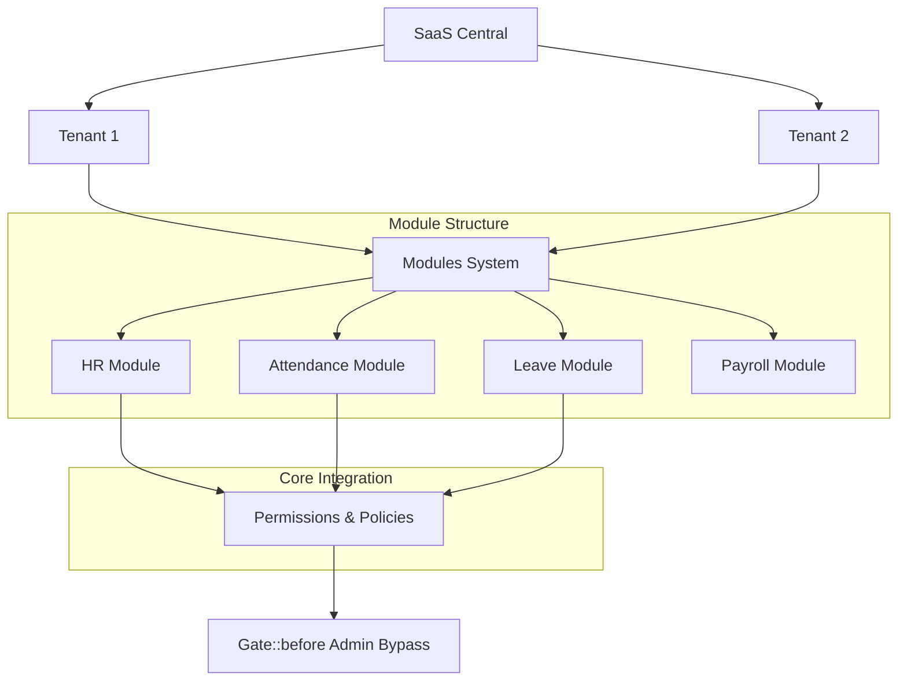

# Project Architecture Guide

This document explains the internal structure of the HRMS SaaS application, including its modular design, policy-based authorization, and system hierarchy.

## 1. System Hierarchy (Project Graph)



## 2. Modular Structure (`app/Modules`)

The application follows a **Modular Monolith** pattern. Each feature set is contained within its own directory in `app/Modules`.

### Module Directory Template:
- **`Controllers/`**: Module-specific logic.
- **`Models/`**: Database entities (e.g., `Employee`, `AttendanceLog`).
- **`Policies/`**: Authorization logic (mapped to Models).
- **`Database/Migrations/`**: Schema changes for the module.
- **`resources/views/`**: Blade templates (accessible via `module-name::view`).
- **`routes.php`**: Route definitions for the module.

## 3. Authorization Policy Pattern

We use Laravel Policies combined with Spatie Permissions.

### The Flow:
1. **Controller** calls `$this->authorize('view', $model)`.
2. **Policy** checks for a specific permission slug.
3. **AppServiceProvider** (`Gate::before`) bypasses checks for `tadmin`, `tmanager`, and `superadmin`.

### Policy Implementation Example:
```php
// app/Modules/HR/Policies/EmployeePolicy.php
public function view(User $user, Employee $employee)
{
    // 1. Check if same tenant
    if ($employee->tenant_id !== $user->tenant_id) return false;

    // 2. Custom permission check (standardized slug)
    return $user->hasPermissionTo('view-employees');
}
```

## 4. Multi-Tenancy Logic

- **Global Scope**: Most models use a `TenantScope` to ensure users only see data belonging to their `tenant_id`.
- **Central Database**: All tenants live in the same database but are separated by `tenant_id` columns.
- **Role Scoping**: Spatie's `setPermissionsTeamId($tenantId)` is used to ensure roles/permissions are tenant-specific.

## 5. Development Rules
1. **Modules**: Never create cross-module dependencies directly; use Services or Events.
2. **Permissions**: Always use the **Hyphenated Slug Standard** (see [PERMISSIONS_GUIDE.md](PERMISSIONS_GUIDE.md)).
3. **Database**: Always include `tenant_id` in new module tables.
